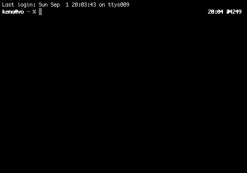

.. include:: common.d

|UBASE| – Unix concepten
========================

:Auteur: Raphael ‘kena’ Poss

Je wordt aangeraden om dit hoofdstuk over de loop van een paar weken
rustig door te nemen, om alles goed te laten bezinken.

Een deel van dit hoofdstuk is afgeleid van de `Introductie Unix`_.

.. contents:: Inhoud
   :local:


Waar ben ik?
------------

.. index:: console

Je zit voor je Unix systeem. Je scherm staat aan, toetsenbord reageert
goed: je :def:`console` staat klaar voor gebruik.

.. index:: sessie, gebruikersessie

Iedere Unix gebruiker werkt binnen een :def:`sessie` die hem/haar
identificeert.  Als je nog geen sessie open hebt, moet je dat nu
doen: log in met gebruikersnaam en wachtwoord.

Als je bent ingelogd, zie je een startsscherm. Er zijn veel
verschillenden soorten Unixsystemen: sommige presenteren alleen een
terminal, met puur tekst als in- en uitvoer. Anderen presenteren een
grafische interface. De meest gebruikelijke grafische interfaces zijn:

- de zogenaamde X11 interface, te vinden op meeste werkcomputers zoals de computers bij de UvA;
- de Android interface, te vinden op alle Android toestellen (mobieltjes / tablets);
- de Quartz interface, te vinden op MacOS X.

Voor deze introductie gaan we beginnen met X11. Zoals je zal ontdekken
is de grafische interface alleen een dunne laag tussen de gebruiker en
het systeem; alle Unix systemen werken min of meer met dezelfde
concepten eronder. De kennis die je met deze introductie zal
verzamelen is dus grotendeels toepasselijk in andere Unix omgevingen,
ongeacht wat je op het scherm kunt zien.

Om die onderliggende, gezamenlijke concepten te leren, gaan we dus de
grafische interface grotendeels negeren voor deze introductie. Na de
introductie, zal je zelf begrijpen hoe grafische tools zich koppelen
aan de rest van het systeem *in het algemeen*. Daarvandaan ben je dan
in staat om iedere soort Unix systeem te gebruiken, zelfs als de
grafische interface afwijkt van wat je vandaag bij de UvA ziet.

Een terminal vinden
```````````````````

.. index:: terminal

Je ziet dus een scherm met visuele elementen. Als je al een terminal
voor je neus hebt, kun je deze paragraaf overslaan. Anders moet je op
zoek naar een terminal. Er is vast ergens op het scherm een menu die
je toegang geeft tot alle beschikbare applicaties. Een terminal is
gebruikelijk te vinden bij een menu "Hulpprogramma's", "Utilities",
"Systeem" of "Development". Al je Unixsysteem een visuele zoekfunctie
heeft, kun je deze ook gebruiken: zoek naar "Terminal" of "xterm". Als
je een veld kunt vinden om een commando handmatig in te voeren, tik
dan ":program:`xterm`" in. Op Linux (maar niet andere Unixsystemen) kun je
ook toegang krijgen tot een volscherm terminal door :kbd:`Ctrl+Alt+F1`
tegelijk te drukken op het toetsenbord; daar moet je opnieuw een
sessie openen door je gebruikersnaam en wachtwoord in te tikken. Je
kunt terug naar de grafische omgeving met :kbd:`Alt+F7`.

Een terminal ziet er ongeveer zo uit:



Het kleurenschema (zwart op wit, wit of zwart, wit op groen, etc) maakt
natuurlijk niet uit. Zorg er alleen voor dat de tekst groot genoeg is
om je ogen niet in te hoeven spannen.

Wat je ziet is een plek waar je commando's in kan tikken op het
toetsenbord. Dit heet de "command line", of :def:`commandolijn`.

Shell en programma's
````````````````````

.. index:: shell

Meerdere programma's delen de terminal om met jou te communiceren. Het
"hoofdprogramma" dat je als eerste ziet heet de :def:`shell`: het is het
programma dat je commando's zal herkennen en uitvoeren.

Aan het begin heb je een soort mini-teksteditor voor maar 1 regel
tekst, voor je commando. Hier kan je je eerste commando editen: de
lettertoetsen om tekst toe te voegen, pijltjes te navigeren, maar ook:

- :kbd:`Ctrl+A` om te navigeren naar het begin van de regel,
- :kbd:`Ctrl+E` naar het eind,
- :kbd:`Alt+F` (of :kbd:`Esc`, dan :kbd:`F`) naar het volgende woord,
- :kbd:`Alt+B` (of :kbd:`Esc`, dan :kbd:`B`) naar het vorige woord.
- :kbd:`Ctrl+H` als je :kbd:`backspace` toets het niet goed doet (gebeurt helaas vaak)

Zodra je een commando valideert met de :kbd:`Enter` toets, zal de shell
zoeken naar de betekenis van je commando, en als het een programma is
zal de shell een nieuw proces aanmaken om je programma te
draaien. Zodra dit gebeurt, geeft de shell tijdelijk controle van de
terminal aan het nieuwe programma, totdat het programma klaar is.

Tik maar bijvoorbeeld in::

   echo hello; sleep 5

(dan :kbd:`Enter`)

Met deze regel vraag je aan je shell om eerst het commando |echo(1)|_ te
draaien om tekst te printen op de terminal, dan het commando |sleep(1)|_
om 5 seconden te wachten. Zolang de commando's draaien, hebben ze
controle over je terminal en zal de shell wachten. Je kunt pas een
commando opnieuw intikken als het vorige commando klaar is.

Een terminal en een shell zijn de eenvoudigste interface naar een
Unix systeem. Ze vormen een soort sequentieel interactieplan, waar de
shell en commando's om en om de terminal met jou delen.

In... maar ook uit!
````````````````````

Veel introductiecursussen en documentaties laten zien hoe je
programma's kunt opstarten, en dingen ermee kunt doen. Wel leuk, maar onze
ervaring als studenten is dat het hoofdprobleem altijd is: "hoe kom ik
terug naar een bekende situatie?". Stel je voor: je hebt een programma
geopend, en je weet niet hoe je hem kunt afsluiten. Wat dan?

Vaak werkt de :kbd:`Esc` toets *niet*. De toetscombinatie :kbd:`Alt+F4` ook
niet. Dan op een terminal is er natuurlijk geen klein kruis waarop je
kunt klikken met je muis, of vinger op een touchscreen.

.. index:: Ctrl-D (invoer afsluiten)
.. index:: SIGHUP
.. index:: Ctrl-C (programma afsluiten)
.. index:: SIGINT
.. index:: kill
.. index:: PID
.. index:: process ID
.. index:: Ctrl-Z
.. index:: SIGTSTP

Op Unix zijn er meerdere manieren een programma af te sluiten:

1. als je programma een overzichtelijke interface heeft met duidelijk
   aanwijzing van hoe je hem kunt afsluiten, gebruik dan dat.

2. als je programma een soort commandolijn heeft waar je commando's
   blijkt in te kunnen tikken, probeer dan de woorden ":program:`quit`" of
   ":program:`exit`" in te tikken. Soms is de letter :kbd:`q` alleen al
   genoeg. Als het niet werkt, probeer dan ":program:`help`". Tik
   bijvoorbeeld de volgende commando's in je terminal, en test jezelf
   dat je ze kunt afsluiten met een commandowoord::

     gdb
     bc
     expect
     telnet
     csh
     gnuplot

3. zo niet, als je programma meestal gebaseerd is op invoer vanuit een
   terminal, gebruik dan de toetscombinatie :kbd:`Ctrl+D`. Deze combinatie wordt
   ook beschreven als :kbd:`^D` in documentatieteksten; het betekent
   "de huidige invoer beëindigen". Tik de volgende commando's in je
   terminal, en test jezelf dat je ze kunt afsluiten met :kbd:`^D`::

       cat
       sort
       uniq
       sed
       perl
       python

   NB: De meeste commando's die ":program:`exit`" of ":program:`quit`" ondersteunen
   kunnen ook worden afgesloten door :kbd:`^D`.

4. als :kbd:`^D` het niet doet, kun je een "gewelddadigere" manier
   gebruiken: de toetscombinatie :kbd:`Ctrl+C`, ook geschreven als
   :kbd:`^C`. Het betekent "een signaal sturen aan het proces om zich af
   te sluiten", zonder te veel vragen te stellen. Het werkt met bijna
   alle programma's, tenminste die die de toetscombinatie niet
   specifiek hebben uitgeschakeld. Tik de volgende commando's in, en
   zie voor jezelf hoe je ze kunt afsluiten met :kbd:`^C`::

       top
       yes
       sleep 10
       hexdump /dev/urandom

   NB: :kbd:`^C` werkt ook vaak als een programma lang niet reageert, of
   als je niet wil wachten.

5. als het je niet lukt met de stappen #1-#4 het programma af te
   sluiten, heb je misschien te maken met een van "de bijzondere 4":

   - het programma :program:`vi` or :program:`vim` (teksteditor): die
     wordt afgesloten door :kbd:`Esc`, :kbd:`:` (dubbele punt),
     :kbd:`q`, :kbd:`!`, :kbd:`Enter` in te tikken.

   - het programma :program:`emacs` (een andere teksteditor): die wordt
     afgesloten door :kbd:`Ctrl+X`, dan :kbd:`Ctrl+C` in te tikken.

   - het programma :program:`ssh` (om een andere computer te benaderen, zal je later zien in |USRV1|_): die
     wordt afgesloten door uit te loggen binnen de ssh sessie. Mocht
     dit niet lukken, bijvoorbeeld door een netwerkprobleem, kan
     :program:`ssh` worden afgesloten door :kbd:`Enter`, :kbd:`~`, :kbd:`.` in te tikken.

   - het programma :program:`telnet`: tik dan :kbd:`Ctrl+]` in, dan :program:`exit`.

6. als alles tot nu toe heeft gefaald, kan je de "final solution"
   gebruiken. Dit werkt op alle processen, op alle commando's, en je
   moet dus voorzichtig mee omgaan: het commando :program:`kill`.

   Om :program:`kill` te kunnen gebruiken, moet je toegang hebben tot een
   commandolijn. Natuurlijk, als je :program:`kill` nodig hebt, is de kans
   groot dat je huidige terminal bezet is door het commando dat je wil
   beëindigen. Wat dan? Twee oplossingen.

   Eerst kan je kijken of :kbd:`^Z` het doet. :kbd:`^Z` betekent "het
   huidige programma pauzeren, sturen naar de achtergrond, en de shell
   met commandolijn die erachter aan het wachten was terug naar de
   voorgrond plaatsen". Sommige programma's die niet op :kbd:`^C`
   reageren kunnen wel naar de achtergrond worden geplaatst met
   :kbd:`^Z`.

   Als :kbd:`^Z` het niet doet, kun je ook een andere terminal openen op
   hetzelfde systeem. Zelfs als het dan opnieuw moet inloggen, heb je
   toegang tot alle processen die je al draaiend hebt in je eerdere
   sessie.

   Zodra je wel een commandolijn beschikt naast het programma die je
   wil beëindigen, moet je zijn :def:`procesidentificatienummer` weten, ook
   "PID" genoemd. Die vind je door het commando ":program:`ps x`", dat een
   lijst geeft van al jouw processen die nu draaien op het
   systeem. Het identificatienummer is dan te vinden in de eerste
   kolom.

   Met het PID kun je dan het commando :program:`kill` intikken, gevolgd door
   een spatie, dan het PID, dan :kbd:`Enter`. Dit stuurt hetzelfde signaal
   als :kbd:`^C` maar dan ook als het proces de toetscombinatie
   heeft uitgeschakeld.

   (NB: het was trouwens niet de hele waarheid: alleen het commando
   :program:`kill` met een PID is soms niet genoeg. Het commando :program:`kill`
   heeft wel een "ultieme" vorm, maar deze zal je pas later
   ontdekken.)

Samenvatting toetscombinaties
``````````````````````````````

Tot nu toe heb je de volgende al geleerd:

================================= ============= ============================================ =========================
Toetscombinatie                   Waar?         Beschrijving                                 Wordt ook uitgedrukt als
================================= ============= ============================================ =========================
:kbd:`Ctrl-A`                     Shell, Emacs  Begin van de lijn                            :kbd:`^A` / :kbd:`C-a`
:kbd:`Ctrl-E`                     Shell, Emacs  Eind van de lijn                             :kbd:`^E` / :kbd:`C-e`
:kbd:`Alt-F` / :kbd:`Esc-F`       Shell, Emacs  Volgende woord                               :kbd:`ESC F` / :kbd:`M-f`
:kbd:`Alt-B` / :kbd:`Esc-B`       Shell, Emacs  Vorige woord                                 :kbd:`ESC B` / :kbd:`M-b`
:kbd:`Ctrl+H`                     Shell, Emacs  Eerste karakter links verwijderen.           :kbd:`^H` / :kbd:`C-h`
:kbd:`Ctrl-D`                     Tekstinvoer   Tekstinvoer beëindigen                       :kbd:`^D`
:kbd:`Ctrl-C`                     Shell         Huidige regel negeren, opnieuw beginnen      :kbd:`^C`
:kbd:`Ctrl-C`                     algemeen      Huidige programma beëindigen                 :kbd:`^C`
:kbd:`Ctrl-Z`                     algemeen      Huidige programma pauzeren, achtergrond      :kbd:`^Z`
:kbd:`Esc` - :kbd:`:q!`           vi, vim       vi/vim beëindigen
:kbd:`Ctrl-X  Ctrl-C`             Emacs         Emacs beëindigen
:kbd:`Enter` :kbd:`~.`            ssh           ssh beëeindigen
:kbd:`Ctrl+]` dan :program:`exit` telnet        telnet beëindigen
================================= ============= ============================================ =========================

Zoals je ziet kan dezelfde toetscombinatie meerdere functies hebben,
afhankelijk van welk programma het ontvangt. Daarom is het belangrijk
te begrijpen dat de programma's samen de terminal delen, maar dat
meestal maar één programma actief is aan het "hoofd" van de terminal.

Documentatie zoeken
-------------------

Het is natuurlijk altijd mogelijk je browser te openen en naar hulp
gaan vragen op een forum of zo. Maar het wordt ook verwacht dat je
weet dat veel informatie al beschikbaar is binnen je Unix systeem!

Informatie over commando's
``````````````````````````

.. index:: man
.. index:: manpage
.. index:: apropos

- om te weten wat een bepaald commando doet: gebruik dan
  ":program:`man`". Dit is een interface naar de zogenaamde "online
  Unix manual": een collectie tekstpagina's en artikelen, ook
  :def:`manpages` genoemd. De meeste commando's hebben allemaal een eigen
  pagina in de manual.

  Tik dus in: :program:`man man` :kbd:`Enter`

  en lees de pagina voor het commando |man(1)|_ zelf om het leren gebruiken.

  Als je :program:`man` draait en als de tekst niet volledig binnen de
  terminal past, krijg je een soort navigatieinterface. Die bestuur je
  door je toetsenbord:

  - :kbd:`Spatie` om naar de volgende pagina te navigeren,
  - :kbd:`b` naar de vorige pagina,
  - de pijltjes "omhoog" en "omlaag",
  - :kbd:`q` om de navigatie te verlaten,
  - :kbd:`/` en dan een zoektekst om iets te zoeken.

  Zoals je snel zal ontdekken, bevatten manual pages vaak meer
  informatie dan wat je nodig hebt. Gebruik dan "/EXAMPLES" :kbd:`Enter` om
  snel de voorbeelden te vinden. Veel pagina's hebben voorbeelden.

  Voor meer informatie: https://en.wikipedia.org/wiki/Man_page

- om te herinneren welk commando iets doet, als je de naam van het
  commando bent vergeten: ":program:`apropos`".

  Stel je voor bijvoorbeeld dat je niet meer weet welk commando je
  moet gebruiken om een proces te beëindigen. Je denkt aan het woord
  "terminate" maar dit is geen commando. Dan tik je :program:`apropos
  terminate` in: |apropos(1)|_ zoekt in alle beschikbare manual
  pagina's naar het woord "terminate" en laat je zien de naam van de
  pagina's die het woord bevatten. Hiermee zie je waarschijnlijk snel
  weer een referentie naar het programma |kill(1)|_.

- om snel te weten welke opties een programma heeft. Je kunt natuurlijk
  het commando |man(1)|_ gebruiken, maar de meeste programma's reageren
  ook op de optie ``--help`` of ``-h``. Probeer bijvoorbeeld::

      ls --help
      man --help
      grep --help

  Misschien past de tekst van het programma niet volledig binnen je
  terminal. Als je terminal wordt weergegeven in een grafische omgeving,
  beschik je misschien over een scrollbar. (Dit is een luxe.) Zo niet, kan je
  het woord ":program:`|more`" toevoegen aan het eind van je commandolijn,
  bijvoorbeeld::

      ls --help | more

  Dit werkt op alle Unix systemen, ongeacht de omgeving waar je een
  terminal hebt.

Naast die opties bestaat er nog een bijzonder hulp-systeem, die heet
:program:`info`. Weinig programma's maken gebruik van |info(1)|, maar voor de
enkele programma's die er wel in staan, is de documentatie daar zeer
uitgebreid en vaak van zeer hoge kwaliteit. Je hoeft het nu niet te
leren gebruiken, maar onthoud hem voor later, voornamelijk voor je
vakken over compiler/vertalerbouw.

In je webbrowser
``````````````````

Je wordt aangeraden om de volgende bookmarks bij te houden in je
webbrowser.

- How to ask a smart question: http://faculty.gvc.edu/ssnyder/121/Goodquestions.html

- How to ask questions the smart way: http://catb.org/~esr/faqs/smart-questions.html

- Stack Exchange, Unix: http://unix.stackexchange.com/

- Stack Exchange, Super User: http://superuser.com/

- Op IRC: https://www.freenode.net/

Draaiende programma's
---------------------

Eerder heb je al geleerd hoe je :kbd:`^Z` kan gebruiken om een programma
tijdelijk te stoppen en sturen naar de achtergrond; heb je ook geleerd
hoe je de commando's |ps(1)|_ en |kill(1)|_ kunt gebruiken om een
programma af te sluiten.

Door |ps(1)|_ heb je waarschijnlijk veel andere programma's zien draaien
die je misschien had verwacht. Een Unix systeem heeft vaak tientallen
:def:`processen` draaien in de achtergrond.

Het volgende plaatje laat zien hoe je Unix systeem eruit ziet "van binnen":


Opstarten, communiceren en eindigen / afsluiten
````````````````````````````````````````````````

.. index:: init (proces)
.. index:: pstree

Ieder proces wordt *opgestart* (rode pijlen) door een ander proces,
behalve :program:`init`. Alle processen zijn dus gerelateerd door een
ouder-kind relatie in een boomstructuur. Je kunt deze structuur
bekijken door het programma |pstree(1)|_ te draaien.

Hiernaast *communiceren* processen met elkaar (groene pijlen in het
plaatje). Bijvoorbeeld, de shell communiceert (voor de commandolijn)
met de terminal. Alle commando's opgestart door de shell communiceren
ook met de terminal.

Hier moet je letten op het volgende:

  *Als een programma wordt afgesloten, worden zijn kind-programma's
  (en kleinkinderen) niet automatisch afgesloten. Echter, alle
  programma's die met hem communiceren worden geïnformeerd dat het
  communicatiekanaal afgesloten wordt.*

Voor de meeste programma's geldt dat als hun communicatiekanaal wordt
afgesloten, ze zelf ook eindigen. Dit is de reden waarom alle programma's
binnen je sessie automatisch eindigen als je je terminal afsluit.

Maar als een programma niet communiceert met de terminal, is het
mogelijk dat het niet beseft dat de terminal wordt afgesloten. Dan
blijft het programma draaien in de achtergrond.

Acties op processen
````````````````````

Als je een commando intikt in de shell, wordt een proces aangemaakt in
het systeem om het programma te draaien.

Je hebt eerder gezien hoe je met |kill(1)|_ een proces kunt beëindigen.

Tot nu toe ziet er alsof je de volgende kunt doen met een proces:

- het opstarten vanuit een shell;
- zijn communicatiekanalen afsluiten:

  - door :kbd:`Ctrl+D` op de terminal, of
  - door de processen aan de andere kant van de communicatiekanalen af te sluiten;

- het beëindigen door :kbd:`Ctrl+C`;
- wachten totdat het zelf klaar is.

.. index:: signaal (procesbeheer)

Technisch gezien zijn alle interacties met processen gebaseerd op de
volgende principes (dit zal je verder bestuderen in het vak
Besturingssystemen):

- een proces "van binnen" dupliceren ("fork" in zijn eigen code);
- een proces "van binnen" vervangen ("exec" in zijn eigen code);
- een proces "van binnen" beëindigen ("exit" in zijn eigen code);
- met andere processen communiceren "van binnen" ("read"/"write" in zijn eigen code);
- een :def:`signaal` sturen van een proces naar zichzelf of naar een ander process.

Bijvoorbeeld, als je een commando intikt in een shell, gaat de shell
zichzelf dupliceren met "fork", dan in de nieuwe kopie van zichzelf,
zichzelf vervangen met "exec" door het programma wiens naam je hebt
ingetikt.

.. index:: SIGHUP

Als je :kbd:`Ctrl+D` gebruikt, of als je een terminal afsluit terwijl
commando's "erin" draaien, dan gebeurt er het volgende: zodra het
programma weer probeert te lezen op zijn invoerkanaal, of schrijven op
zijn uitvoerkanaal, gaat hij automatisch van het systeem een signaal
ontvangen (``SIGHUP``) die zegt "oeps, je communicatiekanaal is
weg". Voor de meeste programma's betekent het gewoon "afsluiten".

.. index:: SIGTSTP

De toetscombinatie :kbd:`Ctrl+Z` stuurt alleen het signaal "``SIGTSTP``" aan
het proces op het hoofd van je terminal. De consequentie ervan, een
pauze en dan de shell zien terugkomen op de voorgrond, gebeurt door
het afhandelen van dit signaal door het proces zelf en de shell
erachter.

.. index:: SIGTERM

Het commando :program:`kill`, ondanks zijn naam, is alleen een programma om
signalen te sturen aan andere processen. Als je geen signaalnaam
aangeeft, stuurt hij automatisch ``SIGTERM``.

Je kunt er meer over leren in |kill(1)|_ en |signal(3)|_.

*Opdracht:* op basis van het plaatje hierboven, en je begrip van
signalen, probeer te gokken wat gebeurt als je het signaal ``SIGTERM``
stuurt aan het proces Xorg (of misschien heet het enkel "``X``" op je
systeem).

.. admonition:: Antwoord
   :class: toggle

   Het proces Xorg eindigt. Dit sluit de communicatiekanaal naar de
   verschillende programma's die X11 gebruiken, inclusief bijvoorbeeld
   de terminal.  Wanneer de terminal eindigt, sluit het dan zijn
   communicatiekanaal met de processen opgestart vanaf de
   terminal. Als die processen dan met de terminal proberen te
   communiceren, krijgen ze automatisch ``SIGHUP``, en eindigen zo.

   Een interessante feature is dat een programma die niet met X11 of
   een terminal probeert te communiceren in het achtergrond blijft
   draaien, zelfs nadat Xorg is opgeruimd.

Jobbeheer
``````````

Je kent nu al |ps(1)|_, |kill(1)|_, en het concept van signalen.

Een applicatie hiervan is het zogenoemde "job control" protocol. Dit is
een feature van de shell en is beschikbaar met bijna alle shells op alle Unix systemen.

.. index:: fg
.. index:: bg
.. index:: jobs

Probeer het volgende:

1. Draai het commando: :program:`sleep 300`.
2. Toets :kbd:`^Z`. Je shell zegt dan "[1]+  Stopped" of iets dergelijks.

   Op dit moment is je proces gepauzeerd in de achtergrond.
3. Draai het commando: :program:`jobs`

   :program:`jobs` laat zien welke processen zijn nu opgestart door je shell.
4. Draai het commando: :program:`fg %1`

   :program:`fg` brengt een proces die op de achtergrond zit terug aan het
   hoofd van de terminal, en activeert hem weer als het gepauzeerd
   was. Hier komt dus :program:`sleep` terug.
5. Toets :kbd:`^Z` weer.
6. Draai het commando: :program:`bg %1`

   :program:`bg` laat een proces in de achtergrond, maar activeert hem
   weer. Hierdoor blijft het proces draaien, alleen zit hij niet meer
   aan het hoofd van de terminal. Je kunt dan tegelijk iets anders
   gaan doen, bijvoorbeeld andere commando's intikken in je shell, of
   een andere commando terugbrengen aan het hoofd van je terminal.
7. Draai het commando: :program:`vim`
8. Toets :kbd:`^Z` weer.
9. Draai het commando: :program:`jobs`

   Hier zie je twee processen: :program:`sleep` van eerder, die nog draait; en
   :program:`vim` die gestopt is.
10. Draai het commando: :program:`kill %1`.

    Dit stuurt ``SIGTERM`` aan de eerste job om het af te sluiten.
11. Draai het commando: :program:`fg`

    Dit brengt de andere job aan de voorgrond en activeert hem weer.
12. Sluit die laatste job af zelf.

Hiermee heb je geleerd:

=================== ==========================
Toets/Commando      Beschrijving
=================== ==========================
:kbd:`^Z`           Proces pauzeren (``SIGTSTP``), sturen naar achtergrond
:program:`jobs`     Lijst van jobs aangeven
:program:`fg %N`    Breng een job terug aan het hoofd van de terminal, en activeer hem
:program:`bg %N`    Activeer een job weer maar laat hem in de achtergrond
:program:`kill %N`  Stuur een signaal aan een job.
=================== ==========================

Om er meer over te leren: https://en.wikipedia.org/wiki/Job_control_%28Unix%29

Je teksteditor kiezen
---------------------

Als je het nog niet weet: er is een soort "religieuze oorlog" tussen
de gebruikers van het programma Vi en de gebruikers van
Emacs. Het is al bijna 30 jaar zo, en het blijft waarschijnlijk
nog 30 jaar zo.

- https://en.wikipedia.org/wiki/Editor_war
- http://www.c2.com/cgi/wiki?EmacsVsVi

En je wordt ook waarschijnlijk verzocht om een kant te kiezen. :)

Als je helemaal niet tussen Emacs and Vi wil kiezen: :program:`joe`, :program:`nano`
en :program:`pico` zijn andere kleine, eenvoudige interactieve teksteditors
die bijna overal beschikbaar zijn.

Anders:

- Vi (:program:`vi` of zijn modernere versie :program:`vim`): werkt op basis van twee
  modi voor interactie: een "controle" modus en een "invoer" modus. Je
  wordt er een beetje schizofreen van. In de "controlemodus" van
  :program:`vi` tik je "commando's" om operaties uit te voeren op de tekst:
  tekst zoeken, verplaatsen, vervangen, etc. In tegenstelling tot
  :program:`emacs` zijn de commando's van :program:`vi`/:program:`vim` redelijk logisch te
  onthouden. Ook heeft :program:`vi` meestal geen toets *combinatie* nodig,
  waar je met meerdere vingers tegelijk moet duwen op je toetsenbord.

- Emacs (:program:`emacs`): werkt op basis van zijn eigen besturingssysteem,
  geprogrammeerd in het eerbiedwaardige programmeertaal LISP. Emacs is
  dus heel krachtig met heel veel functionaliteit, maar dus ook
  wat ingewikkelder goed te leren gebruiken. Emacs maakt veel
  gebruik van toetscombinaties.

Om meer erover te weten:

- VIM:

  - Overzicht: https://en.wikipedia.org/wiki/VIM
  - Leuke tutorial: http://vim-adventures.com/

- Emacs:

  - Overzicht: https://en.wikipedia.org/wiki/Emacs
  - Leuke tutorial: http://david.rothlis.net/emacs/howtolearn.html

Kortom, in de praktijk:

=================== ============== ===========================
Actie               In vi/vim      In Emacs
=================== ============== ===========================
Editor afsluiten    :q / :q!       :kbd:`C-x C-c`
Bestand openen      :e <file>      :kbd:`C-x C-f`
Bestand opslaan     :w             :kbd:`C-x C-s`
Bestand sluiten     :close         :kbd:`C-x k`
Navigeren           Pijlen         Pijlen
Zoeken              /              :kbd:`C-s`
Navigeren           h/j/k/l        :kbd:`C-p` / :kbd:`C-n` / :kbd:`C-b` / :kbd:`C-f`
Tekst verwijderen   x              :kbd:`C-h`
Regel verwijderen   dd             :kbd:`C-k`
Annuleren           u              :kbd:`C-_`
Tekst toevoegen     i              Gewoon invoeren
Naar controlemodus  :kbd:`Esc`     :kbd:`M-x`
=================== ============== ===========================


(Zelf)evaluatie
---------------

1. Je computer lijkt traag te lopen. Hoe onderzoek je de oorzaak?

   .. admonition:: Oplossing
      :class: toggle

      ::

        top
        # evt ook:
        top -o cpu
        # of, grafisch wat aantrekkelijker (moet mogelijk wel apart geïnstalleerd worden):
        htop

2. Wat zijn de standaard toetscombinaties om de cursor naar het begin
   en naar het eind van de huidige regel te verplaatsen? (in een shell
   en bv. emacs)

   .. admonition:: Oplossing
      :class: toggle

      :kbd:`Ctrl-A` en :kbd:`Ctrl-E`

3. Je loopt vast in een onbekend programma. Wat doe je om het af te sluiten?

   .. admonition:: Oplossing
      :class: toggle

      Eerst door programma UI proberen als het duidelijk is. Anders
      :kbd:`Ctrl+D`. Anders :kbd:`Ctrl+C`. Anders |ps(1)|_ en dan |kill(1)|_.

4. Je wordt gevraagd om een onbekend programma voor het eerst te gebruiken. Hoe leer
   je meer over zijn gebruik?

   .. admonition:: Oplossing
      :class: toggle

      Eerst kijken met |man(1)|_ of |info(1)|_. Anders op Internet
      zoeken. Als dit niet lukt, aan iemand vragen.

5. Je draait de volgende twee commando's achter elkaar in je shell::

       sleep 100 &
       sleep 100 &
       ps

   Hoeveel regels met "``sleep``" zie je in de output van :program:`ps`?

   .. admonition:: Oplossing
      :class: toggle

      Twee (of meer als andere instanties van |sleep(1)|_ eerder zijn opgestart).

6. Je draait het commando ``sleep 100&`` in je terminal, dan sluit je
   je terminal af. Je maakt dan weer een nieuwe terminal open, en dan draai
   je |ps(1)|_. Is het programma |sleep(1)|_ steeds actief?

   .. admonition:: Oplossing
      :class: toggle

      Ja, want de processen opgestart vanaf de eerste terminal alleen
      worden beeindigd (met ``SIGHUP``) wanneer ze met de gesloten
      terminal proberen te communiceren. Omdat |sleep(1)|_ niet
      communiceert, blijft het gewoon draaien in het achtergrond.

7. Wat zijn de toestscombinaties om vi en emacs af te sluiten?

   .. admonition:: Oplossing
      :class: toggle

      Vi: ``:q!``
      Noot: het uitroepteken zorgt ervoor dat je wijzigingen niet opgeslagen worden! Gebruik om op te slaan :w

      Emacs: :kbd:`Ctrl-X Ctrl-C`

8. De uitvoer van een commando past in je terminal niet. Wat doe je dan?

   .. admonition:: Oplossing
      :class: toggle

      ":program:`| more`" of ":program:`| less`" toevoegen aan het
      eind van het commando.


Verder inlezen
--------------

- Raphael Poss. Introductie Unix, sectie `"Vergeet niet voor later"`__, 2013.

  .. _`Introductie Unix`: http://science.raphael.poss.name/intro-unix.html
  .. __: http://science.raphael.poss.name/intro-unix.html#vergeet-niet-voor-later

- University of Surrey. `UNIX Introduction`__. 2001.

  .. __: http://www.ee.surrey.ac.uk/Teaching/Unix/unixintro.html

- Oliver Elliott. `An Introduction to Unix`__. 2014.

  .. __: http://www.oliverelliott.org/article/computing/tut_unix/

- Machtelt Garrels. `Introduction to Linux - a Hands on Guide`__. 2008.

  .. __: http://tldp.org/LDP/intro-linux/html/index.html